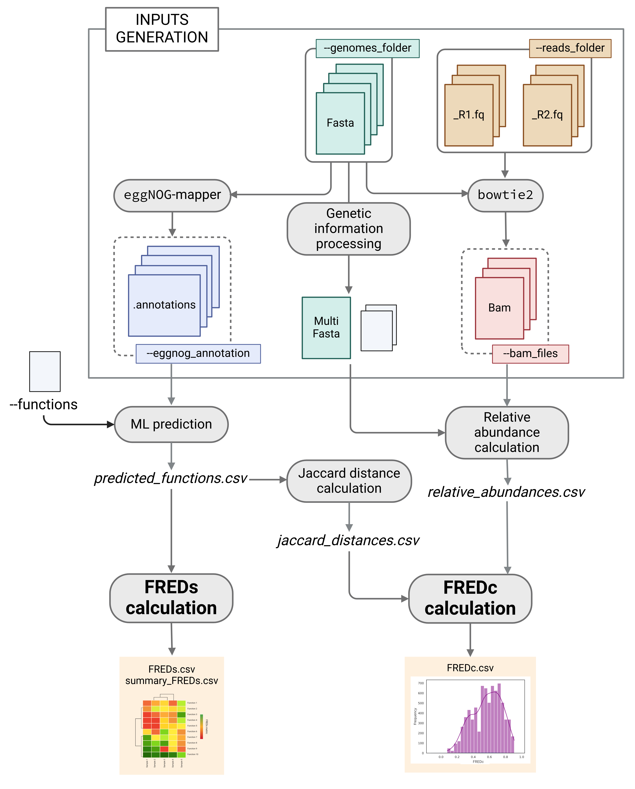

# miFRED
**Microbial phenotype-based functional redundancy calculator from metagenomics data**: community-level functional redundancy (FREDc) and redundancy of 86 metabolic and ecological phenotypes (FREDs)

## **Overview**
miFRED is a fast, user-friendly pipeline to calculate functional redundancy (FRED) using as functional units 86 phenotypes predicted by MICROPHERRET machine learning models from KEGG orthologs (KO). 

The pipeline processes metagenomic samples by taking as input:
- metagenomic reads from each sample
- individual fasta files representative of each genome in the samples.
Designed for multiple-sample analysis, it enables direct comparisons across microbial communities in a single run. 

miFRED can automatically generate any missing input file using built-in software if needed. Initial input generation steps include:
- genome functional annotation using eggNOG-mapper
- alignment of metagenomic reads to the genomes using Bowtie2
- sorted bam files generation with Samtools.
eggNOG-mapper annotation and alignment files can be provided directly as input. 

The core process uses MICROPHERRET function-specific ML models for phenotype prediction and calculates FRED.  For the acetoclastic methanogenesis phenotype, the refined version of the model previously provided by the authors was used. The obtained functional profiles are scanned to generate a Jaccard distance matrix, representing the functional overlap within genome pairs. By default, the Jaccard distance between genomes without associated functions is set to 1. 
Alignment results are processed to calculate relative abundances, which, along with the Jaccard distance matrix and predicted functional profiles, are used to compute FREDc and FREDs metrics. 

miFRED calculates the following metrics:
- **FREDc**, based on Ricotta *et al.*
- **FREDs "number"**: number of genomes performing each function in each sample
- **FREDs "proportion"**: the fraction of community carrying out each function
- **FREDs "relative abundance sum"**: total relative abundance of these genomes

Outputs include several files storing the calculated FRED metrics, summary statistics and distribution plots. Intermediate results are also provided, including MICROPHERRET functional predictions, Jaccard distances between organisms and relative abundance values.



## **Installation**
1. Download the miFRED folder from this repository:
   
     ```git clone https://github.com/sfraulini/miFRED/```
   
2. Unzip training set files inside the Data folder
   
3. Download MICROPHERRET folder from github and move it inside miFRED/Data/:
   
     ```git clone https://github.com/BizzoTL/MICROPHERRET/```

4. Download MICROPHERRET ML models from the designated MEGA folder linked in [GitHub](https://github.com/BizzoTL/MICROPHERRET/)
   Ensure that the saved_models folder is placed inside the MICROPHERRET directory within miFRED/Data/ so that each model follows this path structure: ```miFRED/Data/MICROPHERRET/saved_models/```
  
5. miFRED requires an apposite conda environment, which can be generated as follow using the miFRED_environment.yml file in Data:

     ```conda env create -f miFRED_env.yml```

## **Requirements**
miFRED requires a Linux system and at least 6 CPUs due to the computational demands of the MICROPHERRET training process.

## **Usage**
Below are different command examples depending on the inputs provided by the user. The fewer inputs the user provides, the more miFRED will generate automatically.

- For complete input generation, i.e. user provides only the FASTA files folder and metagenomic reads:

   ```python3 miFRED_core.py -g GENOMES_FOLDER -r READS_FOLDER -u {True,False} -A eggnog_annotation -o output_folder```

- If alignment of metagenomics reads against the provided genomes was already performed by the user:

   ```python3 miFRED_core.py -g GENOMES_FOLDER -B BAM_FILES -A eggnog_annotation -o output_folder```

- To compute FRED from KO for comparison analysis::

   ```python3 miFRED_core.py -g GENOMES_FOLDER -B BAM_FILES -A eggnog_annotation -o output_folder --KO```

- For help type the following or look at the Manual:

   ```python3 miFRED_core.py --help```

## **Manual**
### **Inputs**
#### Genomic-related inputs
- ```-g GENOMES_FOLDER, --genomes_folder GENOMES_FOLDER```
> Directory where genomes fasta files are stored
-  ```-x GENOMES_EXTENSION, --genomes_extension GENOMES_EXTENSION```
> Genome fasta files extension (default: .fa)
- ```--all_genomes ALL_GENOMES```
> Multi-fasta file obtained concatenating all single fasta files. Automatically generated by miFRED in input generation step by processing ```-g GENOMES_FOLDER, --genomes_folder GENOMES_FOLDER```. Incompatible with ```-g GENOMES_FOLDER, --genomes_folder GENOMES_FOLDER```
- ```--binning_file BINNING_FILE```
> .txt file with each line listing a scaffold and the corresponding genome/bin name, tab-seperated. Automatically generated by miFRED in input generation step by processing ```-g GENOMES_FOLDER, --genomes_folder GENOMES_FOLDER``` with inputwriter.py additional script. Incompatible with ```-g GENOMES_FOLDER, --genomes_folder GENOMES_FOLDER```, required if ```--all_genomes ALL_GENOMES``` is specified.

#### Alignment-related inputs
- ```-r READS_FOLDER, --reads_folder READS_FOLDER```
> Directory where metagenomic reads fastq files are stored. Incompatible with ```-B BAM_FILES, --bam_files BAM_FILES```
- ```-u {True,False}, --unpaired_reads {True,False}```
> Required if ```-r READS_FOLDER, --reads_folder READS_FOLDER``` is specified. True if fastq file for unpaired reads are also provided in READS_FOLDER, False otherwise (default : True)
- ```-B BAM_FILES, --bam_files BAM_FILES```
> Directory where sample-specific sorted.bam files and indexes are stored. They can be automatically generated by miFRED input generation steps aligning ```-r READS_FOLDER, --reads_folder READS_FOLDER``` against multi-fasta file (either ```--all_genomes ALL_GENOMES``` or results of ```-g GENOMES_FOLDER, --genomes_folder GENOMES_FOLDER```processing). If provided check that names of aligned contigs mirror names in ```-g GENOMES_FOLDER, --genomes_folder GENOMES_FOLDER``` fasta files. If not, provide multi-fasta directly with ```--all_genomes ALL_GENOMES``` and specify right contig names in ```--binning_file BINNING_FILE```

#### Functional annotation-related inputs
- ```-A EGGNOG_ANNOTATION, --eggnog_annotation EGGNOG_ANNOTATION```
> Either directory where genomes eggNOG .annotations files are stored or .csv file obtained from parsing .annotations files, with genomes as rows, KO as columns and KO counts as values. First column must be named "Genomes"
- ```-db EGGNOG_DATABASE, --eggnog_database EGGNOG_DATABASE```
> Directory where eggNOG-mapper database is stored, used to obtain .annotations files by launching eggNOG-mapper on genomes fasta files in the input generation steps. Incompatible with ```-A EGGNOG_ANNOTATION, --eggnog_annotation EGGNOG_ANNOTATION```
- ```-sm {default,fast,mid-sensitive,sensitive,more-sensitive,very-sensitive,ultra-sensitive}, --eggnog-sensmode {default,fast,mid-sensitive,sensitive,more-sensitive,very-sensitive,ultra-sensitive}```
> eggNOG-mapper Diamond search option (default: sensitive). Incompatible with ```-A EGGNOG_ANNOTATION, --eggnog_annotation EGGNOG_ANNOTATION```
                        
#### Function-related inputs
- ```-f FUNCTIONS_LIST, --functions_list FUNCTIONS_LIST```
> .txt file containing MICROPHERRET functions to be considered for the calculation, one per line. (default: 86 functions whose models were accurate on test set, stored in functions.txt)
- ```-s TRAINING_SETS, --training_sets TRAINING_SETS```
> Folder containing the dataset.csv and dataset_acetoclastic_methanogenesis.csv files to be used in the training. (default: ./training_sets/ )
- ```-m MICROPHERRET_PREDICTIONS, --micropherret_predictions MICROPHERRET_PREDICTIONS```
> .csv file containing MICROPHERRET predictions for all the genomes, the first column with genomes names must be unnamed. Incompatible with ``` -k, --KO```
- ``` -k, --KO```
> Calculation must be performed using KO and not MICROPHERRET phenotypes. Incompatible with ```-m MICROPHERRET_PREDICTIONS, --micropherret_predictions MICROPHERRET_PREDICTIONS```
If both ``` -k, --KO``` and  ```-m MICROPHERRET_PREDICTIONS, --micropherret_predictions MICROPHERRET_PREDICTIONS``` are not specified, MICROPHERRET is launched to predict ```-f FUNCTIONS_LIST, --functions_list FUNCTIONS_LIST``` for FRED calculation.

If ``` -k, --KO``` or  ```-m MICROPHERRET_PREDICTIONS, --micropherret_predictions MICROPHERRET_PREDICTIONS``` are specified, ```-f FUNCTIONS_LIST, --functions_list FUNCTIONS_LIST``` and ```-s TRAINING_SETS, --training_sets TRAINING_SETS``` are ignored.

#### Relative abundance-related inputs  
Parameters set to control calculation, aiming at excluding spurious associations.
- ```-c COVERED_GENOME_FRACTION, --covered_genome_fraction COVERED_GENOME_FRACTION```
> Minimum fraction of genome with coverage higher than 0 (breadth of coverage) (default: 0.10)
- ```-t RELATIVE_ABUNDANCE_THRESHOLD, --relative_abundance_threshold RELATIVE_ABUNDANCE_THRESHOLD```
> Minimum relative abundance required to consider a genome as present in a sample (default: 0)

#### General inputs
- ```-o OUTPUT_FOLDER, --output_folder OUTPUT_FOLDER```
> Output directory
- ```-p PROCESSORS, --processors PROCESSORS```
> Number of threads (default: 5)

### **Outputs**
The following folders are generated in the output folder specified by the user.

#### input_fred folder
It stores the results of miFRED's input generation step procedure. The list can change depending on which files were already provided by the user.
- all_genomes.fa
> fasta file obtained by concatenating the files provided by the user. It is the reference used in the alignment procedure. Generated if ```-g GENOMES_FOLDER, --genomes_folder GENOMES_FOLDER``` is specified
- info.txt
> .txt file with each line listing a scaffold and the corresponding genome/bin name, tab-separated. Generated if ```-g GENOMES_FOLDER, --genomes_folder GENOMES_FOLDER``` is specified 
- nreads.txt
> .txt file with number of reads mapped to each sample, used for relative abundance normalisation
- bowtie2 folder
> sorted and indexed bam files obtained by aligning reads against all_genomes.fa with bowtie2 and processing resulting files with Samtools. Generated if ```-r READS_FOLDER```is specified
- eggnog_annotations folder
> contains eggNOG-mapper results. Generated if ```-A EGGNOG_ANNOTATION, --eggnog_annotation EGGNOG_ANNOTATION``` is not specified
- annotation_matrix.csv
> matrix with the genetic information (KO copy number) per genome, with genomes as rows and KO as columns; input required for prediction of phenotypes. Generated if .csv file is not already provided with ```-A EGGNOG_ANNOTATION, --eggnog_annotation EGGNOG_ANNOTATION```
- KO_for_calculation.csv
> matrix used to calculate FRED if ```-k, --KO``` parameter is specified, with genomes as rows, KO as columns and 0/1 values to indicate presence/absence 
  
#### output_micropherret folder
If MCROPHERRET models are used, it stores the results of the ML predictions:
- predict_functions.csv
> matrix with predicted functions per genome
- predict_sum.csv
> number of genomes predicted to perform each function
They are generated only if ```-k, --KO``` and  ```-m MICROPHERRET_PREDICTIONS, --micropherret_predictions MICROPHERRET_PREDICTIONS``` are not specified
  
#### output_fred folder
It stores results of FRED calculation procedure:
- fredc.csv file
> stores results of FREDc calculation for each analysed sample. Additional metrics like alpha diversity (Gini-Simpson index, GSI), a non-normalised version of FREDc(FREDc_tian) and Rao’s entropy for functional diversity are included too.
- freds.csv
> stores results of FREDs calculation for each function for each analysed sample
- FREDs_statistic.csv
> FREDs statistics for each analysed function and sample

Intermediate results are also provided:
- jaccard_distances.csv
> storing the pairwise functional diversity within each genome pair
- used_relative_abundances.csv
> relative abundances computed by miFRED and used for FRED calculation
- normalised_relative_abundances.csv
> relative abundances computed by miFRED, normalised by the number of mapped reads

FREDc and FREDs distribution plot are provided too to aid the analysis. 
